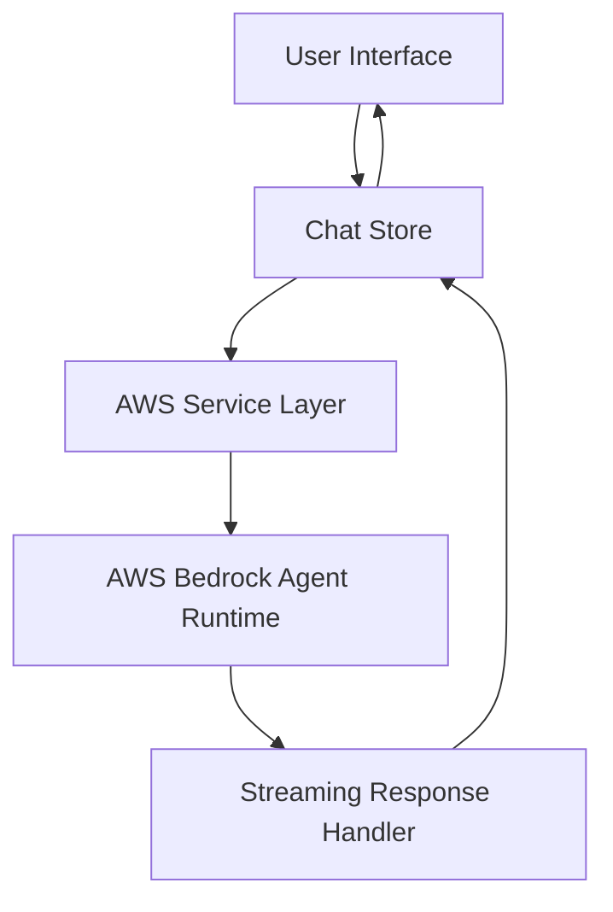
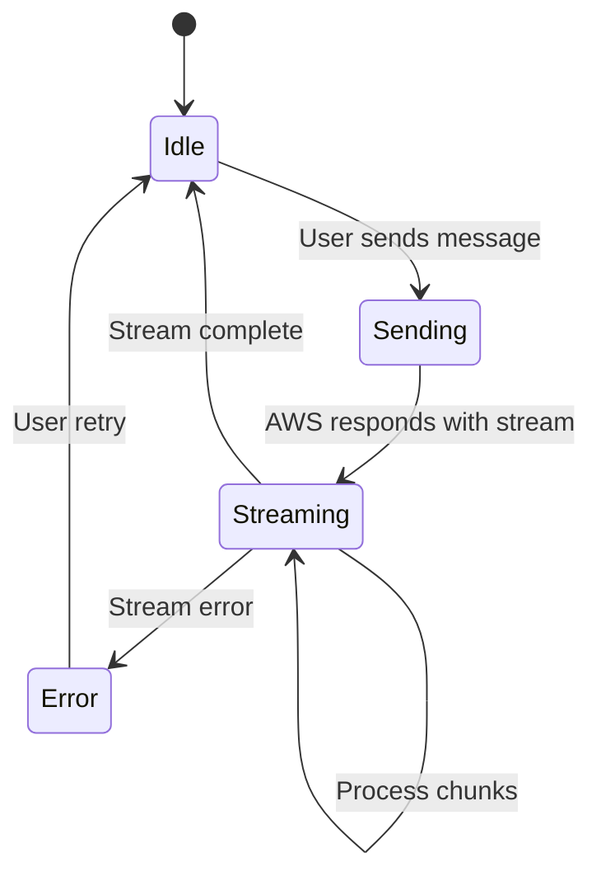

# Design Document

## Overview

The AWS Chatbot Streaming feature will be implemented as a Vue 3 composition API application that provides a real-time chat interface with AWS Bedrock Agent Runtime. The design leverages the existing CoreUI component library for consistent styling and implements streaming response handling using the AWS SDK v3's event-stream capabilities.

The application will follow a reactive architecture where user interactions trigger AWS API calls, and streaming responses are processed in real-time to update the conversation UI incrementally.

## Architecture

### High-Level Architecture



### Component Structure

- **ChatContainer**: Main container component managing the overall chat layout
- **MessageList**: Scrollable container displaying conversation history
- **MessageItem**: Individual message component (user/agent differentiation)
- **MessageInput**: Input component for user message composition
- **StreamingIndicator**: Loading/typing indicator during agent responses

### State Management

Using Pinia store for centralized state management:

- Message history
- Current streaming state
- Error states
- AWS configuration

## Components and Interfaces

### Core Interfaces

```typescript
interface Message {
    id: string
    content: string
    sender: 'user' | 'agent'
    timestamp: Date
    isStreaming?: boolean
    isComplete?: boolean
}

interface ChatState {
    messages: Message[]
    isStreaming: boolean
    currentStreamingMessageId: string | null
    error: string | null
    isConnected: boolean
}

interface AWSConfig {
    region: string
    agentArn: string
    sessionId: string
}
```

### Component APIs

#### ChatContainer

- Props: None (uses store)
- Emits: None
- Responsibilities: Layout management, error boundary

#### MessageList

- Props: `messages: Message[]`
- Emits: None
- Responsibilities: Message rendering, auto-scroll management

#### MessageItem

- Props: `message: Message`, `isStreaming: boolean`
- Emits: None
- Responsibilities: Message display, streaming animation

#### MessageInput

- Props: `disabled: boolean`
- Emits: `send-message: string`
- Responsibilities: Input handling, validation

### AWS Service Layer

```typescript
class AWSBedrockService {
    private client: BedrockAgentRuntimeClient

    async sendMessage(message: string, sessionId: string): Promise<void>
    private handleStreamingResponse(response: InvokeAgentRuntimeCommandOutput): void
    private processStreamChunk(chunk: Buffer): void
}
```

## Data Models

### Message Flow

1. User submits message → Store adds user message
2. Store triggers AWS service call
3. AWS service initiates streaming response
4. Stream chunks processed and appended to agent message
5. Stream completion finalizes message

### State Transitions



## Error Handling

### Error Categories

1. **Network Errors**: Connection failures, timeouts
2. **Authentication Errors**: Invalid credentials, expired tokens
3. **API Errors**: Invalid requests, rate limiting
4. **Streaming Errors**: Interrupted streams, malformed data

### Error Recovery

- Automatic retry for transient network errors (with exponential backoff)
- User-initiated retry for failed messages
- Graceful degradation for partial streaming failures
- Clear error messaging with actionable guidance

### Error UI States

- Inline error messages for individual message failures
- Global error banner for connection issues
- Retry buttons for recoverable errors
- Loading states during retry attempts

## Testing Strategy

### Unit Testing with Vitest

- Component testing for all Vue components (MessageItem, MessageList, MessageInput, ChatContainer)
- Service layer testing for AWS Bedrock integration
- Store testing for Pinia state management
- Utility function testing for streaming and error handling
- Mock AWS SDK responses for reliable testing

### End-to-End Testing with Playwright

- Complete user conversation flows
- Streaming response handling
- Error scenario testing
- Cross-browser compatibility testing
- Mobile responsive testing

### Development Workflow Integration

- Tests run automatically with `yarn test:unit` and `yarn test:e2e`
- Code quality checks with `yarn lint` and `yarn format`
- Type checking with `yarn type-check:all`
- Hot-reload development with `yarn dev`

## Implementation Considerations

### Performance

- Virtual scrolling for large message histories
- Debounced input handling
- Efficient DOM updates during streaming
- Memory management for long conversations

### Security

- Environment variable management for AWS credentials using .env files
- Input sanitization and validation
- Secure session management
- Error message sanitization (no sensitive data exposure)

### Code Quality

- TypeScript strict mode for type safety
- ESLint configuration for Vue 3 and TypeScript
- Prettier formatting with 4-space indentation and 100-character line width
- Comprehensive test coverage requirements

### Responsive Design

- Mobile-first approach using CoreUI responsive utilities
- Flexible message bubble sizing
- Touch-friendly input controls
- Adaptive layout for different screen sizes

### Browser Compatibility

- Modern browser support (ES2020+)
- Progressive enhancement for streaming features
- Fallback handling for unsupported features
