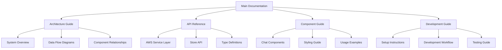

# Design Document

## Overview

The codebase documentation will be structured as a comprehensive developer reference that accurately reflects the current implementation of the AWS Bedrock chatbot application. The documentation will be organized into logical sections covering architecture, API references, component guides, and development workflows, providing both high-level understanding and detailed implementation guidance.

The documentation will leverage the existing codebase structure and follow modern documentation practices with code examples, diagrams, and practical usage scenarios.

## Architecture

### Documentation Structure



### Content Organization Strategy

- **Hierarchical Structure**: Organize content from high-level concepts to detailed implementation
- **Cross-Referenced**: Link related concepts and provide navigation between sections
- **Code-Centric**: Include actual code examples from the existing implementation
- **Practical Focus**: Emphasize real-world usage scenarios and common patterns

## Components and Interfaces

### Documentation Sections

#### 1. Architecture Documentation

**Purpose**: Provide system-level understanding of the application structure

**Content Structure**:

```markdown
# Architecture Overview

## System Components

## Data Flow Patterns

## State Management Architecture

## AWS Integration Architecture

## Component Hierarchy
```

**Key Elements**:

- Component relationship diagrams using Mermaid
- Data flow visualization from user input to AWS response
- State management patterns with Pinia
- Streaming response processing pipeline

#### 2. AWS Service Layer Documentation

**Purpose**: Complete API reference for the AWSBedrockService class

**Content Structure**:

```markdown
# AWS Bedrock Service

## Class Overview

## Configuration Management

## Message Sending

## Streaming Response Handling

## Error Handling

## Connection Management
```

**Key Elements**:

- Method signatures with TypeScript types
- Configuration options and environment variables
- Streaming implementation details
- Error classification and recovery patterns
- Code examples for common use cases

#### 3. Store Documentation

**Purpose**: Comprehensive guide to the Pinia chat store

**Content Structure**:

```markdown
# Chat Store

## State Properties

## Computed Properties

## Actions Reference

## Streaming State Management

## Error Handling

## Session Management
```

**Key Elements**:

- Complete state interface documentation
- Action method signatures and usage
- State transition diagrams
- Reactive patterns and computed properties

#### 4. Component Documentation

**Purpose**: Detailed guide for all Vue components

**Content Structure**:

```markdown
# Chat Components

## ChatContainer

## MessageList

## MessageItem

## MessageInput

## Component Props and Events

## Styling and Theming
```

**Key Elements**:

- Component prop interfaces
- Event emission patterns
- Slot usage and customization
- CoreUI integration examples
- Responsive design patterns

#### 5. Type System Documentation

**Purpose**: Complete TypeScript type reference

**Content Structure**:

```markdown
# Type System

## Core Interfaces

## Message Types

## AWS Types

## Utility Types

## Type Guards

## Validation Functions
```

**Key Elements**:

- Interface definitions with property descriptions
- Type guard usage examples
- Validation utility documentation
- Generic type usage patterns

#### 6. Development Guide

**Purpose**: Practical development workflow documentation

**Content Structure**:

```markdown
# Development Guide

## Environment Setup

## Development Commands

## Testing Strategy

## Code Quality Standards

## Deployment Process
```

**Key Elements**:

- Step-by-step setup instructions
- Command reference with examples
- Testing patterns and best practices
- Linting and formatting configuration

## Data Models

### Documentation File Structure

```
docs/
├── README.md                 # Main documentation entry point
├── architecture/
│   ├── overview.md          # System architecture overview
│   ├── data-flow.md         # Data flow patterns
│   └── component-hierarchy.md
├── api/
│   ├── aws-service.md       # AWS Bedrock service API
│   ├── chat-store.md        # Pinia store API
│   └── types.md             # TypeScript types reference
├── components/
│   ├── chat-container.md    # ChatContainer component
│   ├── message-list.md      # MessageList component
│   ├── message-item.md      # MessageItem component
│   └── message-input.md     # MessageInput component
├── guides/
│   ├── development.md       # Development workflow
│   ├── testing.md           # Testing guide
│   ├── deployment.md        # Deployment guide
│   └── troubleshooting.md   # Common issues and solutions
└── examples/
    ├── basic-usage.md       # Basic implementation examples
    ├── advanced-patterns.md # Advanced usage patterns
    └── customization.md     # Customization examples
```

### Content Templates

#### API Documentation Template

````markdown
## Method Name

**Signature**: `methodName(param: Type): ReturnType`

**Description**: Brief description of what the method does

**Parameters**:

- `param` (Type): Description of parameter

**Returns**: Description of return value

**Example**:

```typescript
// Code example showing usage
```
````

**Error Handling**: Description of possible errors and handling

````

#### Component Documentation Template
```markdown
## ComponentName

**Purpose**: Brief description of component purpose

**Props**:
```typescript
interface ComponentProps {
  prop: Type // Description
}
````

**Events**:

- `event-name`: Description of when event is emitted

**Slots**:

- `slot-name`: Description of slot usage

**Example**:

```vue
<template>
    <!-- Usage example -->
</template>
```

```

## Error Handling

### Documentation Quality Assurance

- **Accuracy Verification**: All code examples will be extracted from or verified against the actual implementation
- **Consistency Checks**: Ensure consistent terminology and formatting across all documentation sections
- **Completeness Validation**: Verify all public APIs and components are documented
- **Example Testing**: Ensure all code examples are syntactically correct and functional

### Content Maintenance Strategy

- **Version Alignment**: Documentation structure allows for easy updates when code changes
- **Modular Updates**: Each section can be updated independently
- **Cross-Reference Integrity**: Maintain links and references between related sections

## Testing Strategy

### Documentation Validation

- **Code Example Verification**: Validate that all code examples compile and run correctly
- **Link Checking**: Ensure all internal and external links are functional
- **Completeness Review**: Verify all public APIs and components are documented
- **Accuracy Validation**: Cross-check documentation against actual implementation

### Content Quality Metrics

- **Coverage**: Ensure all major components and APIs are documented
- **Clarity**: Use clear, concise language with practical examples
- **Usability**: Structure content for easy navigation and reference
- **Maintainability**: Design for easy updates as code evolves

## Implementation Considerations

### Documentation Generation Strategy

- **Manual Creation**: Write comprehensive documentation based on code analysis
- **Code Integration**: Extract actual interfaces and types from source code
- **Example Extraction**: Use real implementation patterns for examples
- **Diagram Generation**: Create visual representations of architecture and data flow

### Content Organization Principles

- **Progressive Disclosure**: Start with overview, drill down to details
- **Task-Oriented**: Organize content around common developer tasks
- **Reference-Friendly**: Structure for quick lookup and reference
- **Example-Rich**: Include practical examples for all major concepts

### Maintenance Workflow

- **Regular Updates**: Plan for documentation updates with code changes
- **Review Process**: Establish review workflow for documentation changes
- **Feedback Integration**: Provide mechanism for developer feedback on documentation
- **Version Control**: Track documentation changes alongside code changes
```
